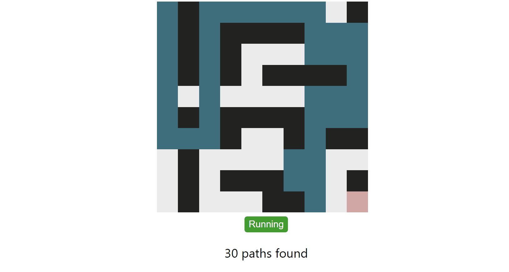

# Algorithms Visualization using HTML, CSS and JavaScript

[Check Here](https://sachuverma.github.io/Algorithms-Visualization/index.html)

## ALL MAZE PATHS
<!-- ## A simple visualization of **backtracking** code [Check Here](https://sachuverma.github.io/Mazepath-Algo-Visualization/)

#### I tried making a visualization for a data structures problem where _we need to find all possible paths from top left cell to bottom right cell in a maze_.

#### I saw this [problem](https://lnkd.in/g4kYp8y) on Pepcoding resourses page. -->

### Approach:

The algorithm used here is backtracking.  
We recursively call for next step in top, left, down, right of current cell and visit it if it's inside maze and is not an obstacle.  
This will follow a path and check if the path reaches the destination or not. If the path does not reach the destination then backtrack and try other paths.

## SHORTEST MAZE PATH

## SORTING ALGORITHMS
